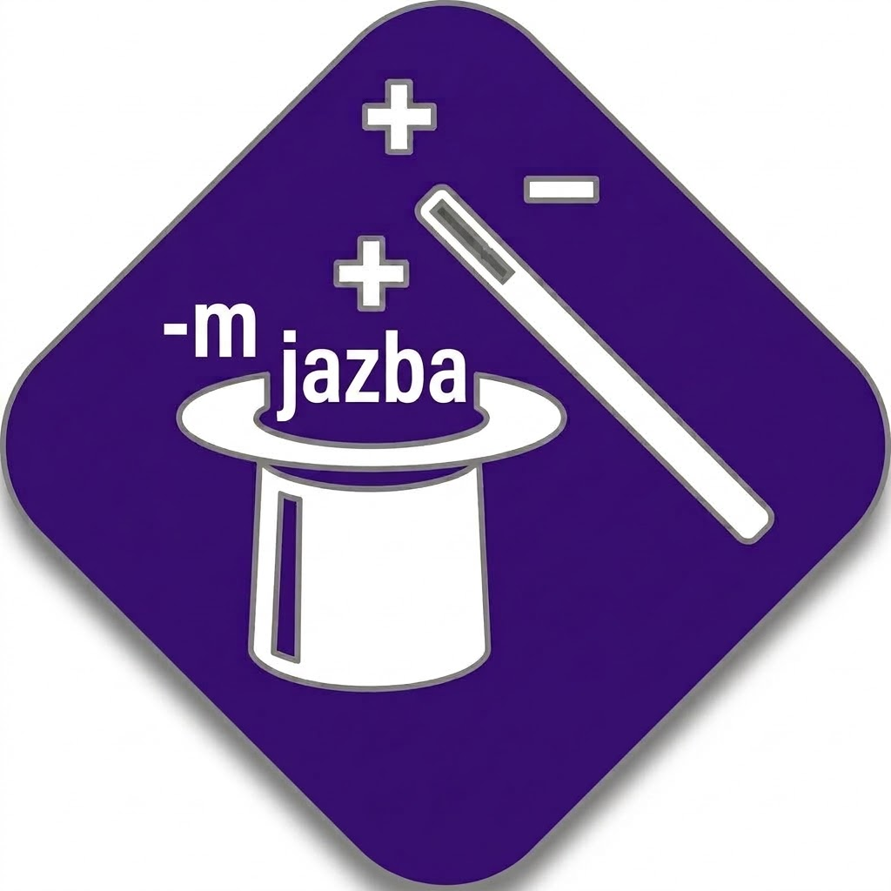
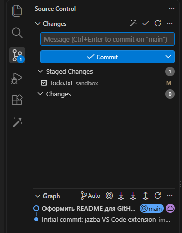
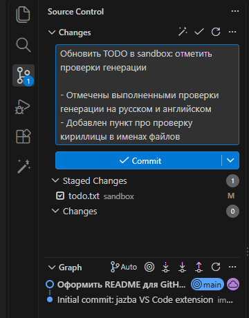
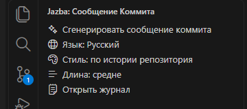
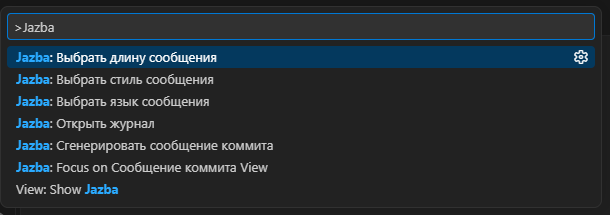

<div align="center">



# Jazba

**Магия для `git commit -m`** — расширение VS Code, которое пишет сообщения коммитов через Claude.

[](https://code.visualstudio.com/)
[](https://www.typescriptlang.org/)
[](https://claude.com/claude-code)
[](LICENSE)

</div>

---

## ✨ Что умеет

- 🪄 **Одна кнопка** — волшебная палочка в тулбаре панели «Система управления версиями» генерирует сообщение по staged-изменениям.
- 🧠 **Учится на вашей истории** — берёт недавние коммиты (ваши и других авторов) как примеры стиля.
- 🌍 **Любой язык** — русский, английский или любой другой (`german`, `french`, …).
- 🎛️ **Стили на выбор** — Conventional Commits, gitmoji, простой императив, развёрнутое сообщение или автоопределение по истории.
- 📏 **Длина под задачу** — от одной строки до заголовка с подробным телом.
- 🗂️ **Панель Jazba** в Activity Bar — язык, стиль и длина переключаются в один клик.
- 🔒 **Без лишних ключей** — использует уже авторизованный `claude` CLI.

## 🚀 Быстрый старт

1. Установите и авторизуйте [`claude` CLI](https://claude.com/claude-code) (он должен быть в `PATH`).
2. Установите расширение из `.vsix`:
   ```bash
   npm install
   npm run compile
   npx vsce package
   code --install-extension jazba-*.vsix
   ```
3. Сделайте `git add` нужных файлов.
4. Нажмите 🪄 в тулбаре панели SCM или выполните **«Jazba: Сгенерировать сообщение коммита»** из палитры команд (`Ctrl+Shift+P`).

Сообщение появится в поле ввода коммита — останется только проверить и закоммитить.

> Кнопка внутри самого поля ввода (`scm/inputBox`) — proposed API VS Code и недоступна
> для обычной установки, поэтому используется `scm/title`.

## 📸 Как это выглядит

<table>
  <tr>
    <td align="center" width="50%">
      <br />
      <sub><b>1.</b> Палочка в тулбаре «Система управления версиями»</sub>
    </td>
    <td align="center" width="50%">
      <br />
      <sub><b>2.</b> Готовое сообщение в поле коммита</sub>
    </td>
  </tr>
  <tr>
    <td align="center" width="50%">
      <br />
      <sub><b>3.</b> Панель Jazba: язык, стиль и длина в один клик</sub>
    </td>
    <td align="center" width="50%">
      <br />
      <sub><b>4.</b> Команды в палитре (<code>Ctrl+Shift+P</code>)</sub>
    </td>
  </tr>
</table>

## ⚙️ Настройки

| Параметр | По умолчанию | Описание |
|---|---|---|
| `jazba.language` | `russian` | Язык сообщения (`russian`, `english` или любое название языка) |
| `jazba.commitStyle` | `auto` | `auto` · `conventional` · `plain` · `gitmoji` · `detailed` |
| `jazba.length` | `medium` | `short` (только заголовок) · `medium` · `long` |
| `jazba.historyCount` | `20` | Сколько последних коммитов брать как примеры стиля (`0` — не использовать) |
| `jazba.claudePath` | `claude` | Путь к CLI `claude` |
| `jazba.claudeExtraArgs` | `[]` | Доп. аргументы CLI, например `["--model", "claude-sonnet-5-5"]` |
| `jazba.timeoutSeconds` | `90` | Таймаут генерации |
| `jazba.maxDiffChars` | `4000` | Предел длины тела диффа, передаваемого модели |

## 🧩 Команды

| Команда | Что делает |
|---|---|
| `Jazba: Сгенерировать сообщение коммита` | Генерирует сообщение по staged-изменениям |
| `Jazba: Выбрать язык сообщения` | Быстрый выбор языка |
| `Jazba: Выбрать стиль сообщения` | Быстрый выбор стиля |
| `Jazba: Выбрать длину сообщения` | Быстрый выбор длины |
| `Jazba: Открыть журнал` | Лог работы расширения |

## 🛠️ Разработка

```bash
npm install
npm run compile      # сборка в dist/
npm run watch        # пересборка при изменениях
npm run typecheck    # проверка типов
npm test             # юнит-тесты
```

Запуск dev-хоста: откройте папку в VS Code и нажмите `F5` («Run Extension»).

```
src/
├── extension.ts     # точка входа, команды
├── claude.ts        # запуск claude CLI
├── diff.ts          # подготовка диффа
├── history.ts       # выборка примеров стиля из истории
├── prompt.ts        # сборка промпта
├── sanitize.ts      # очистка ответа модели
└── controls*.ts     # панель в Activity Bar
```

## 📄 Лицензия

[MIT](LICENSE)
